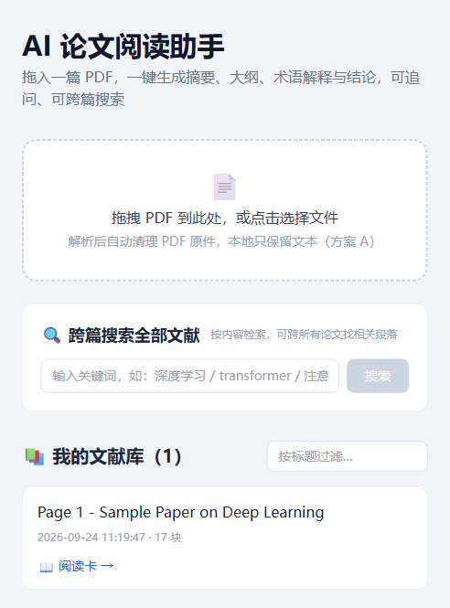
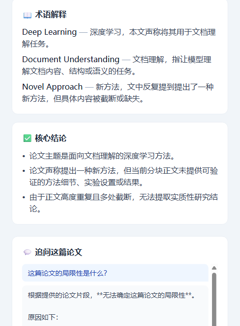
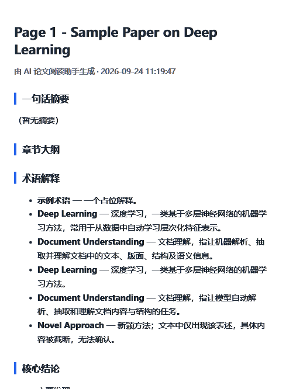

# AI 论文阅读助手 (AI Paper Reader)

**中文** | [English](./README_EN.md)

拖入一篇论文 PDF，一键生成**摘要 / 大纲 / 术语解释 / 核心结论**，可追问，可跨篇搜索，并沉淀为个人文献库（方案 A：只存文本，PDF 即用即清，千篇约 50–200 MB）。

## 功能截图

| | |
| --- | --- |
| 首页 — 上传 / 跨篇搜索 / 文献库 | 阅读卡 — 摘要 / 大纲 / 术语 / 结论 |
|  |  |
| 导出的 HTML 阅读卡 | |
|  | |

## 当前进度

- ✅ **W1（完成）**：核心链路跑通——PDF 解析 → 分块 → 阅读卡生成
- ✅ **W2（完成）**：前端界面（上传/文献库/阅读卡/追问）+ 真实 AI 调用
- ✅ **W3（完成）**：跨篇搜索 + 阅读卡导出（HTML）
- ✅ **W4（完成）**：已发布至 GitHub（Public 仓库）

## 快速开始

```bash
# 后端
cd backend
python -m venv .venv
.venv\Scripts\activate           # Windows
pip install -r requirements.txt

# 命令行跑一篇论文（当前为 mock 模式，无需 API Key）
python -m app.cli --pdf D:\path\to\paper.pdf

# 启动 API 服务（http://127.0.0.1:8000/docs 可看接口文档）
python -m uvicorn app.main:app --port 8000
```

## 配置真实 LLM（可选）

在项目根目录创建 `.env`：

```
LLM_API_KEY=你的DeepSeekKey
LLM_BASE_URL=https://api.deepseek.com
LLM_MODEL=deepseek-chat
```

未配置时自动进入 mock 模式，骨架可离线跑通。

## 已验证接口（W1）

| 方法 | 路径 | 说明 |
| --- | --- | --- |
| GET | /health | 健康检查 |
| POST | /papers/upload | 上传 PDF（解析后自动清理 PDF 本体） |
| GET | /papers | 文献库列表 |
| GET | /papers/{id} | 论文详情 |
| GET | /papers/{id}/reading-card | 生成阅读卡 |
| POST | /papers/{id}/ask | 基于原文追问 |
| DELETE | /papers/{id} | 删除论文 |
| GET | /search?q= | 跨篇全文检索（W3） |
| GET | /papers/{id}/export | 导出阅读卡 HTML（W3） |

## 前端界面（W2 完成）

无需构建，双击打开 `frontend/index.html` 即可（需先启动后端）。

```bash
# 终端 1：启动后端
cd backend
.venv\Scripts\python.exe -m uvicorn app.main:app --port 8000

# 然后双击 frontend/index.html，浏览器里即可：
# 上传 PDF → 看阅读卡 → 追问
```

## 目录结构

```
ai-paper-reader/
├── backend/
│   ├── app/
│   │   ├── main.py            # FastAPI 入口
│   │   ├── cli.py             # 命令行入口
│   │   ├── config.py          # LLM/路径配置（.env）
│   │   ├── db.py              # SQLite + FTS5（含同步触发器）
│   │   ├── routers/           # papers.py / chat.py
│   │   └── services/          # pdf_parser / chunker / llm / summarizer
│   ├── uploads/               # 临时目录（解析后即清）
│   └── tests/
├── frontend/                  # W2 开始开发
├── docs/项目规划.md
└── README.md
```

## 路线图

- v2.0 候选：图表/公式解读、批量导入、浏览器插件、多模型切换、文献相关度排序

## License

MIT